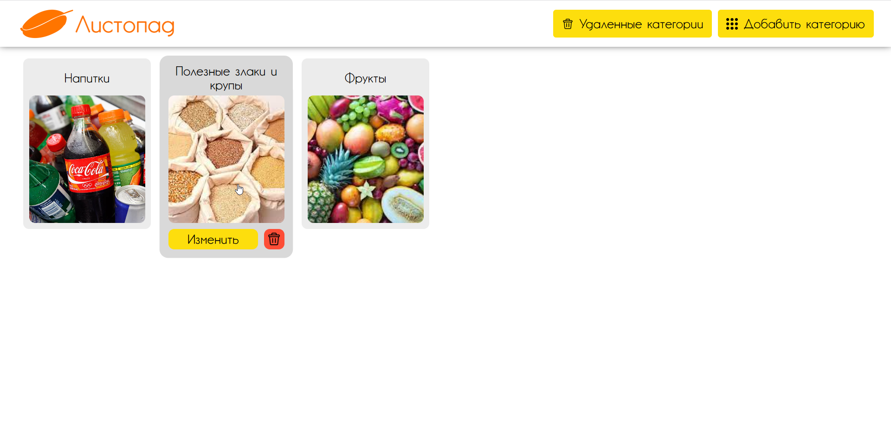
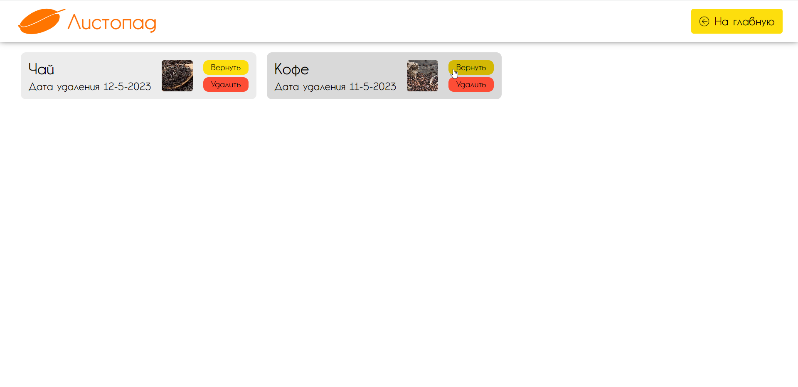
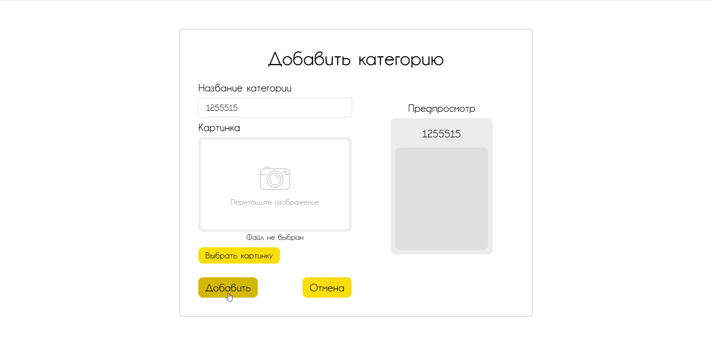

# Продуктовый магазин "Листопад"

## Описание

В продуктовом магазие есть категории товаров. Один товар может принадлежать нескольким категориям. У каждой категории есть название и картинка. В проекте можно создавать, просматривать, измениять и удалять категории. При изменении категории все предыдущие данные будут сохранены и могут быть повторно использованы. 

При переходе к категории откроется список товаров. К каждому товаро можно перейти. Товары также можно добавлять, просматривать, изменять и удалять.

## Демонстрация

### Категории

Страница с категориями товаров. На ней можно удалить категории, перейти к изменению категории, перейти к списку удаленных категорий и перейти к созданию новой категории.  

### Удаленные категории (корзина)

Страница со списком удаленных категорий. После удаления с основной страницы, категории переходят сюда. Здесь можно востановить удаленную категорию, полностью удалить категорию, перейти к категории и вернуться на главную.  

### Создание новой категории

Страница с созданием новой категории. На странице вводится имя категории и указывается картинка, после чего нужно нажать далее для создания. Также можно перейти назад к главной странице.  

## Используемые технологии

Клиентская часть : JavaScript, React, Axios, ReactRouterDom

Серверная часть : ASP.NET Core WEB API, Entity Framework Core, Min Io Asp Net Core, C# 11.0, .NET 7.0

База данных : PostgreSQL

Хранилище файлов : Min IO

Среда разработки : Microsoft Visual Studio Community 2022, Версия 17.4.3

ОС : Майкрософт Windows 11 Pro, Версия 10.0.22000, Сборка 22000

## Папки

### Клиентская часть

* breed-food-store-listopad-app - сторона клиента. Разработана при помощи JavaScript-библиотеки React. Проект создан при помощи шаблона "Автономный проект JavaScript React" в Visual Studio.

### Серверная часть

* BreedFoodStoreListopad.Domain - сущности. Проект содержит классы моделей, которые используются в приложении. Создан при помощи шаблона "Библиотека классов (Майкрософт)" в Visual Studio.
* BreedFoodStoreListopad.Persistence - обращение к внешним источникам данных (базе данных и хранилищу файлов). Проект содержит контексты, миграции, интерфейсы реподиториев и репозитории для доступа к данным. Создан при помощи шаблона "Библиотека классов (Майкрософт)" в Visual Studio.
* BreedFoodStoreListopad.Service - обработка данных. Проект содержит действия, выполняемые над данными, и обработку исключений. Создан при помощи шаблона "Библиотека классов (Майкрософт)" в Visual Studio.
* BreedFoodStoreListopad.Infrastructure - инфраструктура. Проект содержит конфигурации и вью модели (View Model) для отправки запросов. Создан при помощи шаблона "Библиотека классов (Майкрософт)" в Visual Studio.
* BreedFoodStoreListopad.Persistence - маршрутизация. Проект содержит контроллеры для создания конечных точке приложения (get и post) для обращения к API. Создан при помощи шаблона "Веб-API ASP.NET Core (Майкрософт)" в Visual Studio.
* BreedFoodStoreListopad.Tests - тестирование. Проект содержит тесты всех слоев API приложения. Создан при помощи шаблона "Тестовый проект xUnit" в Visual Studio.